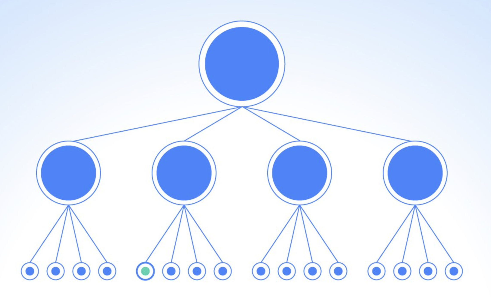
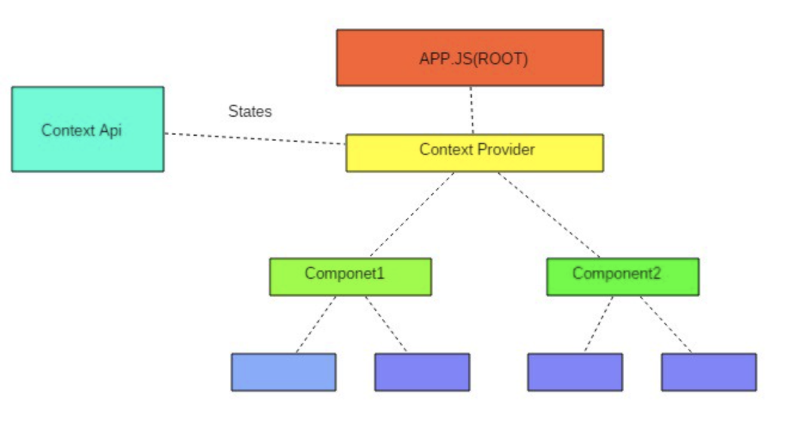

# What is Context API?

Context provides a technique which is unaccompanied by props at each level and which passes the data through the component tree.

In a stereotypical React application, data is passed from top to down (i.e. from parent to child) through props, but for certain types of props, this can be unmanageable (e.g. locale preference, UI theme) that many components need inside an application. 



It lays out a path to share values like these amongst components without having to notably pass a prop through various levels of the tree.

# When Context is actually used?

Global data for a tree (according to React components), is shared using context. For example: current authenticated user, theme, or preferred language. 

With the help of context we can refrain from passing props in-between elements.



# Before Using Context

At different nesting levels, when many components needs to access a particular data, then context comes into play.

Amount of props that we need to pass through the application, which can be reduced by using the "inversion of control" and it thereby makes the code cleaner. This inturn gives more control to the root components. But when we direct towards more complexity higher in the tree then it makes those components even more complex and the lower level components becomes even more flexible.

# How we can Use Context API + Reducer = Redux

we are going to follow certain steps to implement it completely which are as follows.

- Firstly we are going to create our data into store file which will have Global Data in store folder (we can also set our initial state into this if any exists)

  ```react
  const initialState = {
    contacts: [
      {
        id: "007",
        name: "Adhikansh Mittal",
        email: "amittal@dashclicks.com",
      },
      {
        id: "008",
        name: "Devandra Prajapat",
        email: "dprajapat@dashclicks.com",
      },
      {
        id: "009",
        name: "Vikas Agarwal",
        email: "vagarwal@dashclicks.com",
      },
    ],
    loading: false,
    error: null,
  };
  ```


-  Now we have to create our actions. It's an object which have all our functions which we are going to perform but It will not have their implementations we will do it later on ``Provider``.

  ```react
  const actions = {
    DEL_CONTACT: "DEL_CONTACT",
    ADD_CONTACT: "ADD_CONTACT",
    START: "START",
    COMPLETE: "COMPLETE",
  };
  ```


- Now We have to create our reducers. Reducer is a function which we will take our state as well as our actions and on the based of actions it will return the updated state.

  ```react
  const reducer = (state, action) => {
    switch (action.type) {
      case actions.ADD_CONTACT:
        return {
          contacts: [...state.contacts, action.value],
        };
      case actions.DEL_CONTACT:
        return {
          contacts: state.contacts.filter(
            (contact) => contact.id !== action.value
          ),
        };
      case actions.START:
        return {
          loading: true,
        };
      case actions.COMPLETE:
        return {
          loading: false,
        };
      default:
        throw new Error();
    }
  };
  ```


- Now we will create our Context. Creates a Context object will help when React renders a component that subscribes to this Context object it will read the current context value from the closest matching `Provider` above it in the tree.

  ```react
  const ContactContext = React.createContext();
  ```


- Now we will create our own Provider with the React Provider and we will create our playload here value which will can use to get all the changes to the consumer components which subscribes to the that context.

  Plain and simple, it allows functional components in React access to reducer functions from your state management. 

  A value prop is transferred to consuming components which are successor to this providor and are accepted by the Provider component. One Provider can be connected to many consumers. To overrule values thouroughly within the tree, providers are nested. 

  Successors of a Providor, i.e. consumers, will re-render whenever the Provider’s `value` prop changes. 

  The `useEffect` method is exempted from circulation to the successors of the Providor, i.e. consumers  (including [`.contextType`](https://reactjs.org/docs/context.html#classcontexttype) and [`useContext`](https://reactjs.org/docs/hooks-reference.html#usecontext)) .

  ```react
  const ContactContextProvider = (props) => {
    const [state, dispatch] = React.useReducer(reducer, initialState);
  
    const value = {
      contacts: state.contacts,
      start: (value) => {
        dispatch({ type: actions.START, value });
      },
      complete: (value) => {
        dispatch({ type: actions.COMPLETE, value });
      },
      addContact: (value) => {
        dispatch({ type: actions.ADD_CONTACT, value });
      },
      delContact: (value) => {
        dispatch({ type: actions.DEL_CONTACT, value });
      },
    };
  
    return (
      <ContactContext.Provider value={value}>
        {props.children}
      </ContactContext.Provider>
    );
  };
  ```

  The same algorithm as [`Object.is`](https://developer.mozilla.org/en-US/docs/Web/JavaScript/Reference/Global_Objects/Object/is#Description) is used to find out the changes by comparing the newer and the older values. 

